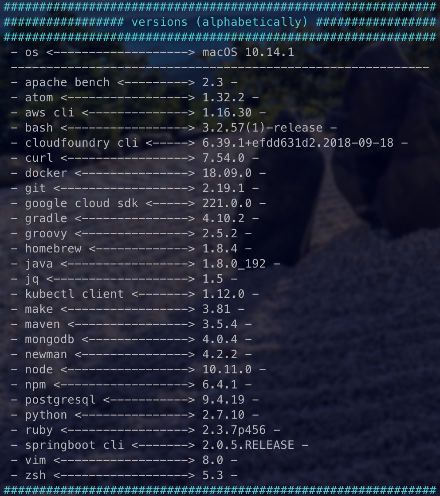

# versions

This is a script to display the version numbers of your tools. 
It is probably never complete... ;) 

## Problem
I want to see the version numbers of all my used tools with one command. 

## Solution
<pre>
This script. ;) 
Actually following tools are listed (alphabetically): 
* OS (Linux / Windows / macOS)
* Angular CLI
* ApacheBench
* Atom
* AWS CLI
* Bash
* CloudFoundry CLI
* Curl
* Docker
* Git
* Google Cloud SDK
* Gradle
* Groovy
* Gulp
* Homebrew
* Java
* JHipster
* Jq
* Kubectl Client
* Make
* Maven
* Minikube
* Node
* Npm
* Python
* Ruby
* SpringBoot CLI
* Terraform
* VueJS
* Vue CLI
* Yarn
* Yeoman
* ZSH

</pre>
Screenshot macOS: 

 

## Usage
#### versions.sh
If you don't have any listed tool, then the script doesn't print it out. 

## Environment Info
##### unix
I am not so familiar with all different unix shells, but i think u can use it with all standard shells 
##### windows
For windows i take the gitBash shell to use the script 

## Contribution
You are welcome to contribute this project! Please follow the standard rules. 
If you find a bug or have any other tools to display, then please firstly open an issue. 
If you are creating a Pull Request, please update the version & date of last change in the script - and use [SemVer](http://semver.org). 
Also please take care to indent with 2 spaces. 
Thank you. 

## Copyright and License
Copyright :copyright: 2018 Michael Wellner ([@m1well](http://www.twitter.m1well.de)) 
Code released under the [MIT License](/LICENSE). 
